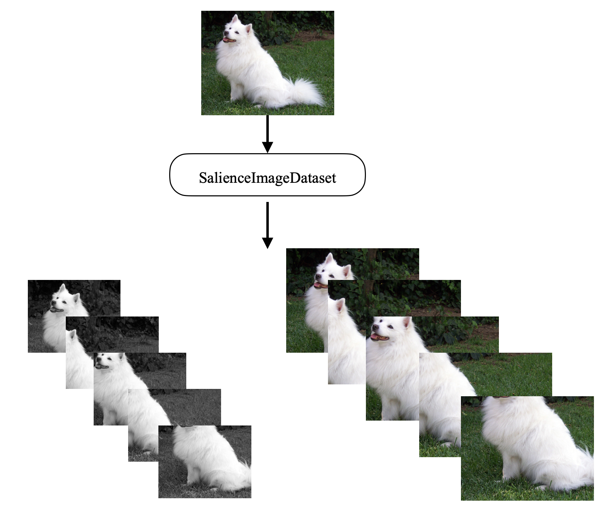
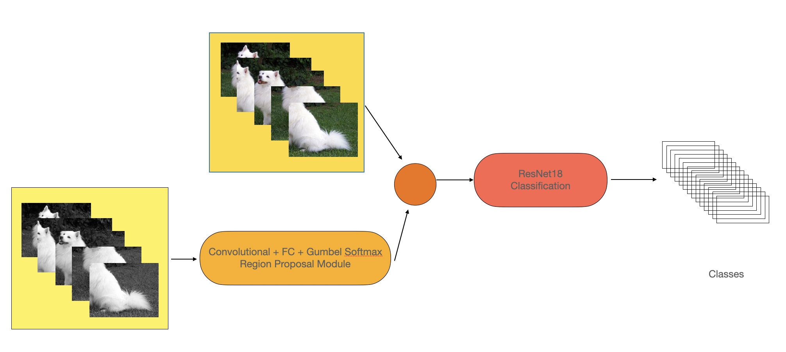
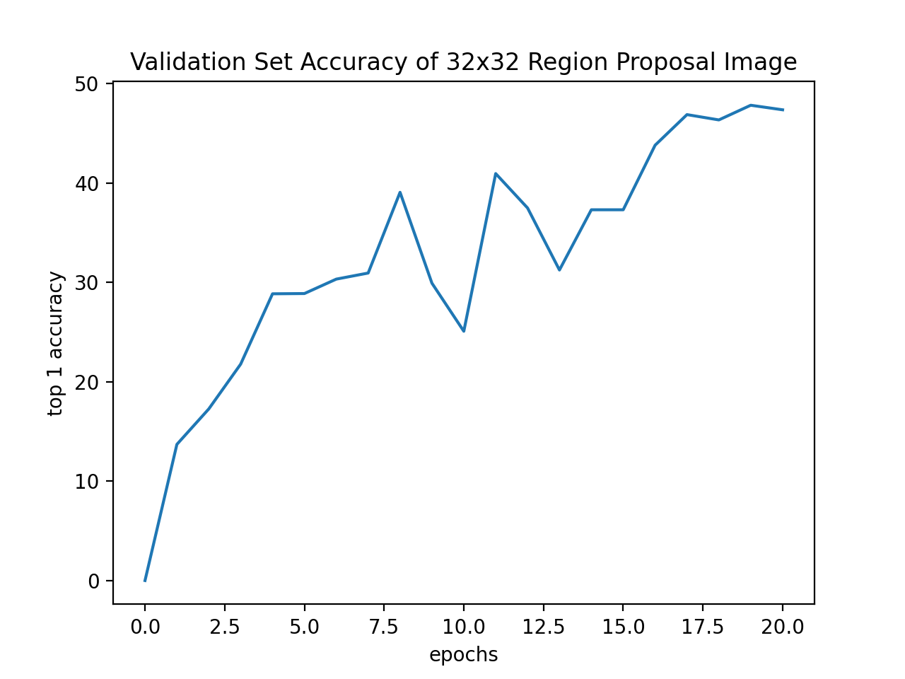
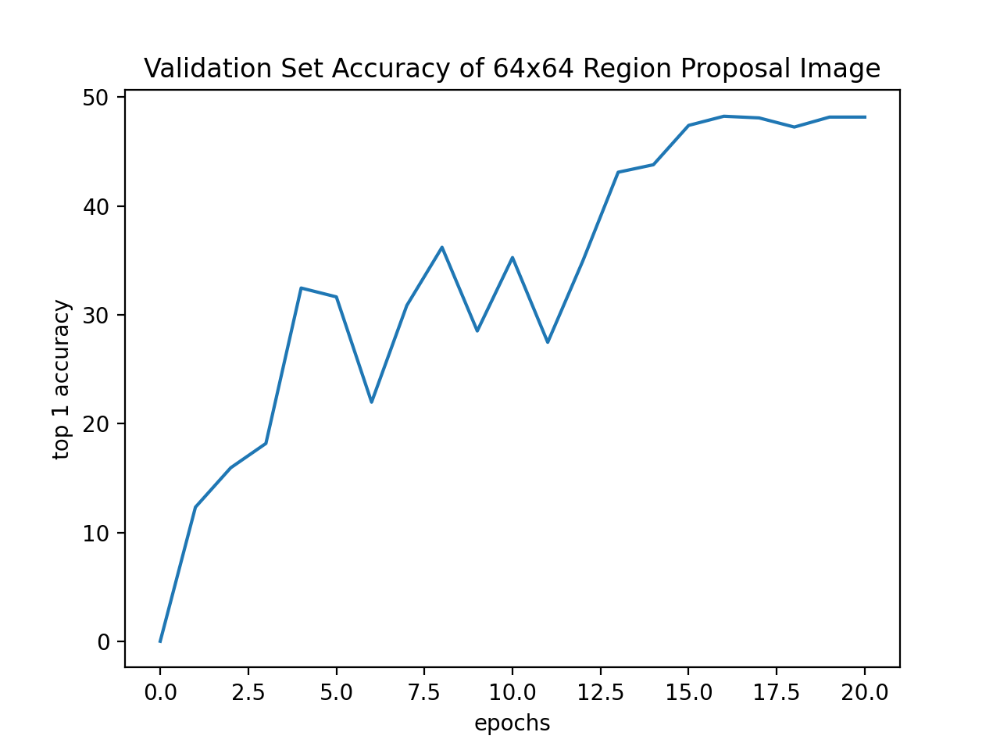
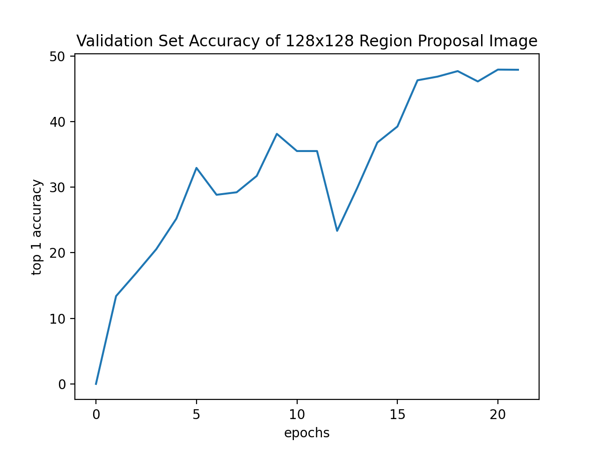
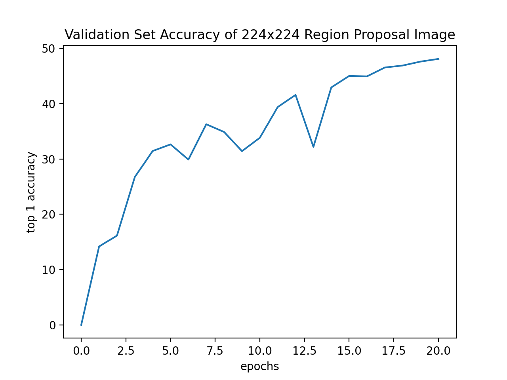
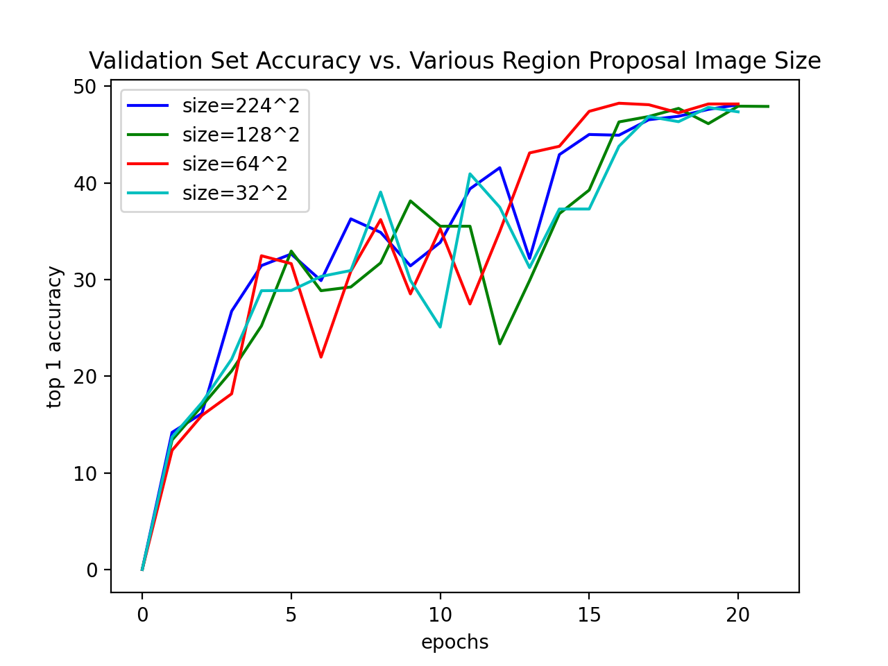

# Project: Using "Salience Map" for Region Proposal

## Github Repository
The project is implemented in a forked [Pytorch Image Model repository](https://github.com/JasmineLi-805/pytorch-image-models).
Since this README is specifically for the course project, I have created a separate repository for the project related portion.

## Video

## Introduction

As introduced in the lectures, image classification networks such as R-CNN and YOLO have a region proposal phase that generates thousands of bounding boxes for later process. However, considering that background often consists of a great portion of an image, many of the bounding boxes are not useful in the classification task, thus there is inefficiency in this method.

In a paper by Yohanandan et al. (mentioned below), the authors suggest that locating the objects of interest could be done with a rather small network and low resolution input. This project would try to utilize the findings of this paper to train an image classification model that alleviates the computation costs on region proposal by using small networks and images. To do so, I will replace the region proposal phase with a light-weight convolutional “salience map” generation module, then attach it to a recurrent-based model, and train the classifier end-to-end.

The model would be evaluated on the accuracy of the classification, and would be compared on the different image sizes used for the region proposal module.

## Related Work

- Yohanandan et al., [Fast Efficient Object Detection Using Selective Attention](https://arxiv.org/abs/1811.07502): This is the inspiration of the project, where the author uses a convolutional network to identify the objects of interest in an image. Different from the paper, this project does not train the salience mapping on its own but attached a classifier after it to train the process end-to-end.
- Jang et al., [Gumbel Softmax](https://arxiv.org/abs/1611.01144): Gumbel softmax is used to generate a probability for each image in containing an object of interest. A higher probability means the classifier is more likely to identify an object of interest from the image.

## Approach

The implementation of this project uses the [Pytorch Image Model](https://github.com/rwightman/pytorch-image-models) Github Repo where it has a series of published neural networks implemented and a tested training/validation workflow. The following section describes the main changes and additional code added for this project.

### Dataset

This project was intended to be tested on the ImageNet dataset, however, due to limitations in computational power and time, a small subset of ImageNet, the [imagenette](https://github.com/fastai/imagenette) dataset, is used instead. It has a total of 10 classes and approximately 13.4k images for training and validation.

### Data Preprocessing

In the design of this project, each image is cropped into a few different smaller images to determine which part is the most significant in classification task. The cropped images would be downsized and turned into grayscale for the region proposal phase, while the original sized cropped image would be weighted on the results of regional proposal and used for classification.
To meet the goal of having different images of different resolutions, a new SalienceImageDataset is added to the collection of datasets in [dataset.py](https://github.com/JasmineLi-805/pytorch-image-models/blob/56bbba2d0466cd55f53f39b017c577bf183b17c2/timm/data/dataset.py#L161).

There are two types of transforms, `downsize_transform` and `original_transform`. The `downsize_transform` is used to create images for region proposal. It crops the images, applies grayscale, downsizes the cropped image, and finally pads the downsized image with 0s. The `original_transform` only crops the original images and outputs a stack of tensors. The results from the two transforms is then stacked into one 4 dimensional tensor. The FiveCrop function is used to crop the images.

The following diagram shows how an image of a dog is processed by the dataset.

### Model

The model also consists of two parts. The first part is a stack of 3 convolutional layers with batch normalization to determine which image is the most useful in classification. The second part is ResNet18 for classification. The model is implemented in [scresnet.py](https://github.com/JasmineLi-805/pytorch-image-models/blob/master/timm/models/scresnet.py) in the Pytorch Image Model repository.

In model.forward, the downsized images first passes the convolutional layers, which outputs a probability using Gumbel Softmax. Then the original-sized cropped images are scaled by the probability and summed to create one 3xWxH image. Finally, ResNet18 would perform the classification task. In this design, it is expected for the regional proposal module to assign higher probability to images more helpful for the classification, and this can be trained with the backpropagation from the classification results.

The following diagram depicts a forward pass of the model.

### Train and Evaluation Code

This project utilizes the existing [training](https://github.com/JasmineLi-805/pytorch-image-models/blob/master/train.py) and [evalutation](https://github.com/JasmineLi-805/pytorch-image-models/blob/master/validate.py) script in the Pytorch Image Model repository. It supports distributed training and evaluation, and the hyperparameters can be set in the execution commands.

## Results

In this project, I decided to do a comparison study on how the size of the downsized image affect the classification accuracy. The trainings are fixed to 20 epochs, learning rate of 0.05, and decay rate of 0.1. The train, validation, and test dataset is split as in the imagenette repository. Since the imagenette dataset is rather small, this project uses the top 1 accuracy on the test dataset for the evaluations.

I trained and evaluated three different image sizes for regional proposal: 1x32x32, 1x64x64, 1x128x128, and 1x224x224. The following are the validation accuracy of each size over the 20 epochs:

 
Of all the different image sizes, size 64^2 received the highest accuracy of 48.24% after 20 epochs, and size 32^2 received the lowest accuracy of 47.81%. That is not a significant difference. Thus, it seems like, at least for few number of epochs, the image size used for region proposal does not significantly affect the classfication accuracy.

Similar patterns can be seen from the diagram above where all the learning curves of different image sizes are plotted in one graph.

## Discussion

By seeing the results, it seems like the current model does not significantly increase the classification accuracy comparing to a ResNet18-only model trained on the same dataset and same number of epochs. In this section, I'd like to mention a few future improvements for the current setup.
- Increase the number of training epochs: 20-epochs is too few for the model to be fully trained on this dataset, so increasing the number of epochs might reveal a more significant difference between the diffent setups.
- Add more ways of cropping the original image: The FiveCrop method does not provide the best variation needed for region proposal, adding more ways, such as taking vertical or horizontal sections of the image, might help the model to locate areas of interest.
- Add the original image into the stack of inputs: It is possible that the entire image is necessary for the classification task, and any type of cropping would negatively impact the classification accuracy.
- Increase the training epochs: Due to the limited computing resource and time, this project was only able to train on very few number of epochs. There seems to be space for improvements in the accuracy diagram. Thus I would consider adding more epochs for a more thorough analysis.
